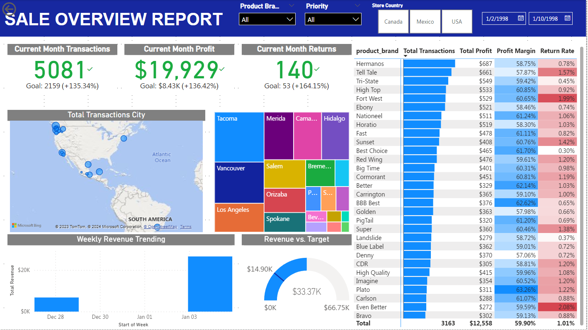

# Optimizing Product Strategy at Maven Market: A Data-Driven Approach

## Dashboard

### Overview


### Basket Analysis


## Objectives

* Tracking key performance indicators (KPIs) like transactions, profit, revenue, and returns over time, analyzing over 269,000 transactions from a two-year period of Maven Market sales. 
* Using the data mining technique, predictive basket analysis, to analyze patterns of co-occurrence and determine the strength of the link between products purchased together, then suggesting combinations of products to evaluate cross-sell, recommendation system.

## Data Source

The Maven Market dataset is associated with a multinational grocery chain that has locations in Canada, Mexico, and the United States. It serves as a resource for various business intelligence projects and data analytics tasks. The dataset encompasses various aspects of the grocery chain's operations, including transactions, customer data, product information, and financial metrics.

More specifically, the dataset includes:
* MavenMarket_Calendar.csv
* MavenMarket_Customers.csv
* MavenMarket_Products.csv
* MavenMarket_Regions.csv
* MavenMarket_Returns_1997-1998.csv
* MavenMarket_Stores.csv
* MavenMarket_Transactions_1997.csv
* MavenMarket_Transactions_1998.csv

## Tools and Techniques

### 1. Data Preprocessing and Cleaning
Power Query Editor for organizing and cleaning the dataset.

### 2. Predictive Basket Analysis
Employed advanced analytical methods using DAX measures to identify patterns and relationships between different products purchased together.

### 3. Data Visualization
Power BI for creating interactive dashboards and visualizations.

## Process

### 1. Data Collection and Integration
Gather data from the Maven Market dataset, which includes details about transactions, products, customer demographics, etc.

### 2. Data Cleaning and Preprocessing
Normalize and standardize the data to ensure consistency, especially if data from multiple sources are combined.

### 3. Basket Analysis
Calculate metrics such as support, confidence, and lift to evaluate the strength of these associations.
* Find the number of orders containing Product 1 
```DAX
Order (P1) = 

var PROD1 = 'Basket Analysis'[Product1]

var PROD1Transactions = SELECTCOLUMNS(FILTER('Transaction Data', 'Transaction Data'[product_id] = PROD1),
                        "Transaction Date", 'Transaction Data'[transaction_date], "Customer ID", 'Transaction Data'[customer_id])

RETURN 
COUNTROWS(PROD1Transactions)
```
* Find the number of orders containing Product 2
```DAX
Order (P2) = 

var PROD2 = 'Basket Analysis'[Product2]

var PROD2Transactions = SELECTCOLUMNS(FILTER('Transaction Data', 'Transaction Data'[product_id] = PROD2),
                        "Transaction Date", 'Transaction Data'[transaction_date], "Customer ID", 'Transaction Data'[customer_id])

RETURN 
COUNTROWS(PROD2Transactions)
```

* Find the number of orders containing both Product 1 & 2
```DAX
Order (P1&P2) = 

var PROD1 = 'Basket Analysis'[Product1]
var PROD2= 'Basket Analysis'[Product2]

var PROD1Transactions = SELECTCOLUMNS(FILTER('Transaction Data', 'Transaction Data'[product_id] = PROD1),
                        "Transaction Date", 'Transaction Data'[transaction_date], "Customer ID", 'Transaction Data'[customer_id])
var PROD2Transactions = SELECTCOLUMNS(FILTER('Transaction Data', 'Transaction Data'[product_id] = PROD2),
                        "Transaction Date", 'Transaction Data'[transaction_date], "Customer ID", 'Transaction Data'[customer_id])

var BothProdTransactions = INTERSECT(PROD1Transactions, PROD2Transactions)

RETURN 
COUNTROWS(BothProdTransactions)
```
```DAX
Support = 
'Basket Analysis'[Order (P1&P2)]/'Basket Analysis'[Order (P2)]
```
```DAX
Confidence = 
'Basket Analysis'[Order (P1&P2)]/'Basket Analysis'[Order (P1)]
```
```DAX
Lift = 
    ('Basket Analysis'[Order (P1&P2)]/'Basket Analysis'[Order (P1)])*'Basket Analysis'[Total Transactions]
    /('Basket Analysis'[Order (P2)])
```

### Insight Generation and Reporting
Translate the analysis into actionable business insights. For instance, identifying product bundling opportunities or targeting specific customer segments with personalized marketing.

### Visualization and Dashboard Creation
Use tools like Power BI to create interactive dashboards that visualize key findings, trends, and patterns.

## Outcome:

* A detailed report on factors contributing to Maven Business in the process of segmenting and penetrating the market.
* A predictive model with high accuracy in forecasting product combinations, recommendations.
* An interactive dashboard providing real-time insights and predictions to BOD and other departments of the company.


